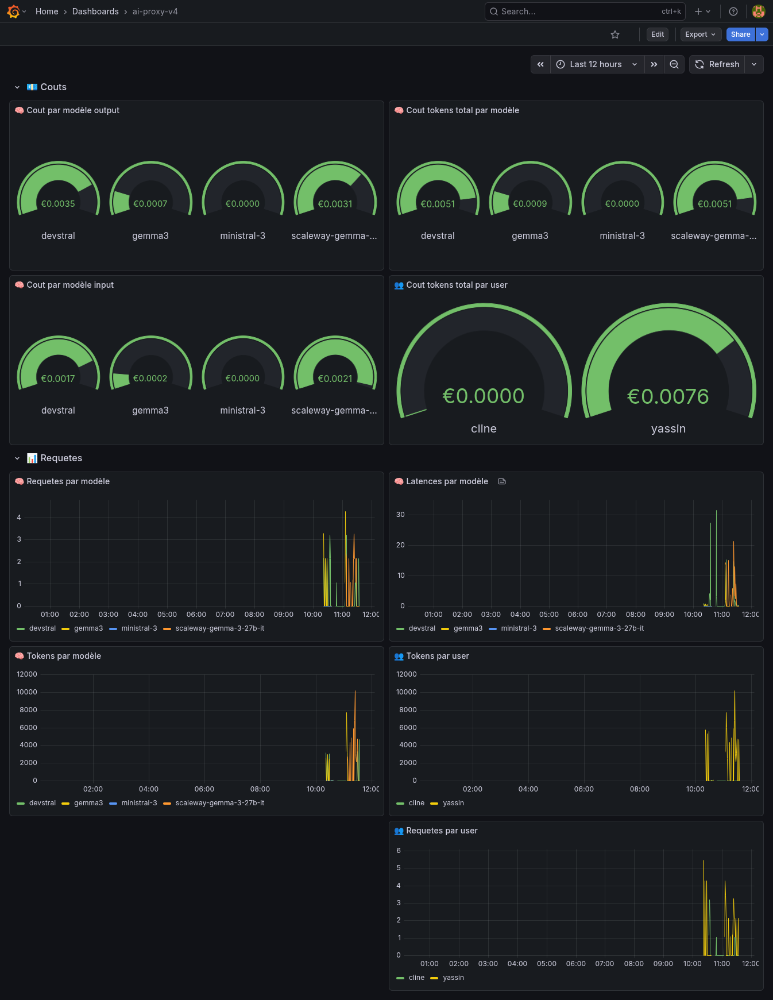

# AI PROXY


AI Proxy is an open-source project that provides a simple way to create a proxy server for LLM models.

Many existing solutions are pseudo-open-source with hidden features behind paywalls. AI Proxy aims to be fully open-source and free to use.


## 🍱 Features
- Monitor requests and responses
- api key model permission management
- Partial Support of openai api endpoint


## 📅 Planned Features
- Rate limiting
- CO2 emission tracking (CodeCarbon API)
- Same model load balancing

## 🚀 Quickstart

**Requirements:**
- Docker

**Copy the example configuration file and edit it to your needs:**

```bash
cp config.example.yaml config.yaml
```
Edit `config.yaml` to set your OpenAI API key and other configurations.
```
metrics_auth:
  username: admin
  password: your-secure-password
model_list:
  - model_name: devstral
    params:
      model: devstral:latest
      api_base: http://ollama-service.ollama.svc.cluster.local:11434/v1
      drop_params: true
      provider: "ollama" # optional, see "Provider mapping" below
      api_key: "no_token"
      cost_per_input_token: 0.25 # Per million token
      cost_per_output_token: 0.80 # Per million token

keys:
  - name: "user"
    token: "token"
    models:
      - "devstral"
    rpm_limit: 30 # Number of request per min, if not set will use 60 by default
```


**Run the server:**

```bash
docker-compose up -d
```

The server will be available at `http://localhost:8000`.
And the docs at `http://localhost:8000/docs`.

## 🔌 Provider mapping

Different backends honor the same OpenAI request parameters through different
native mechanisms. Set the optional `provider` field on a model to translate
OpenAI-style parameters into what that backend actually enforces. Omit it for
OpenAI / Anthropic — their handling is already OpenAI-compatible.

| `provider` | `response_format: {"type": "json_object"}` | `reasoning_effort` |
| --- | --- | --- |
| `llamacpp` | injects a JSON grammar (llama.cpp does not enforce `json_object` on its own) | → `chat_template_kwargs.enable_thinking` |
| `ollama` | native | → native `think` boolean |
| `vllm` | native | native; `none`/`minimal` normalized to `enable_thinking: false` to avoid vLLM's low/medium/high-only 400 |
| *(unset)* | passthrough | passthrough |

`json_schema` structured output is passed through unchanged and enforced natively
on all of the above. `provider` is independent of `drop_params` (which controls
whether non-OpenAI parameters are stripped before forwarding).

**Setup or update Grafana dashboard**



You can import the grafana json dashboard from file `./grafana/provisioning/dashboards/llm-proxy-dashboard.json` 

## 📈 Monitoring
The api exposes prometheus metrics for monitoring.
The prometheus endpoint is available at `http://localhost:8001/metrics`.

exposed metrics:

- 'llm_requests_total','Total number of requests by model and user',
- 'llm_requests_total_user','Total number of requests by user',
- 'llm_tokens_total','Total number of tokens used by model and user',
- 'llm_tokens_total_user','Total number of tokens used by user and model',
- 'llm_request_latency_seconds','Request latency in seconds by model',
- 'llm_request_latency_seconds_user','Request latency in seconds by user',
- "llm_request_input_cost_user","Cost per user input tokens",
- "llm_request_output_cost_user","Cost per user output tokens",
- "llm_request_total_cost_user","Total Cost per user tokens",
- "llm_request_input_cost", "Cost per model input tokens",
- "llm_request_output_cost","Cost per model output tokens",
- "llm_request_total_cost","Total token cost per model",


**Cost monitoring**

For each request the cost per million token is calculated and added on each model and user
The cost is reset each month in database and in the prometheus gauges

**Database storage**

The database stores the following : 
- requests : the question and response are saved,the token count and date
- models: stores the cost for each model 
- users: stores the cost for each user


## Testing

To launch tests 

``` bash
docker compose  --profile test up
```

## ❤ Humans.txt
- aangelot
- pipazoul
- exodev
